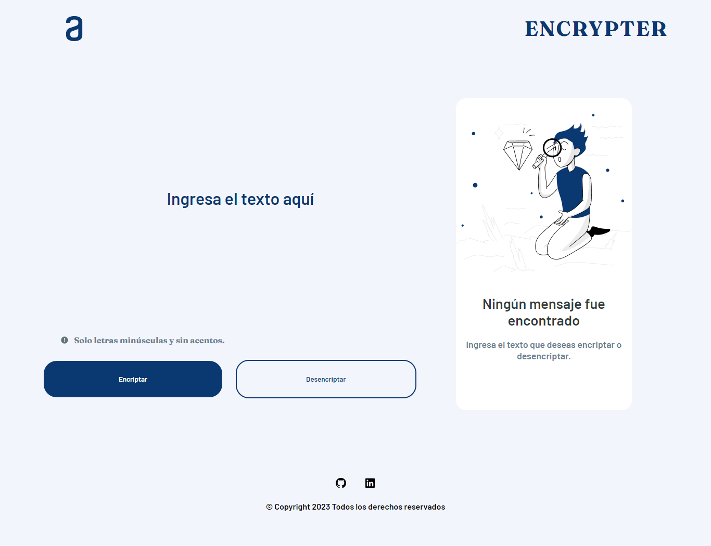

# Encriptador de texto

## Tabla de contenido

- [El desafio](#el-desafio)
    - [Requisitos](#requisitos)
    - [Extras](#extras)
- [Screenshot](#screenshot)
- [Links](#links)
- [Proceso](#proceso)
    - [Construido con](#construido-con)
    - [Lo que aprendí](#lo-que-aprendí)
- [Autor](#autor)

## 📌 El desafio

### Descripcion
Primer reto del curso ONE Oracle Next Education + Alura Latam

El reto consiste en desarrollar una pagina web que tenga las funciones de encriptar y desencriptar un texto dado por el usuario, utilizando las tecnologias de JavaScript, HTML y CSS.

### Requisitos

- Debe funcionar solo con letras minúsculas
- No deben ser utilizados letras con acentos ni caracteres especiales
- Debe ser posible convertir una palabra para la versión encriptada también   devolver una palabra encriptada para su versión original.

Por ejemplo:

"gato" => "gaitober"

gaitober" => "gato"

- La página debe tener campos para
inserción del texto que será encriptado o desencriptado, y el usuario debe poder escoger entre as dos opciones.
- El resultado debe ser mostrado en la pantalla.

### Extras
- Un botón que copie el texto encriptado/desencriptado para la sección de transferencia, o sea que tenga la misma funcionalidad del ctrl+C o de la opción "copiar" del menú de las aplicaciones.

## 📷 Screenshot

## 🔗Links

- Github Site URL: [Encriptador](https://javilh97.github.io/encriptador/)
- Netlify Site URL: [Encriptador](https://astonishing-figolla-5b5781.netlify.app)

## 👨‍💻Proceso

### 🔧Construido con

    
    
    

### 📖 Lo que aprendí

Durante la realización de este reto aprendí a mejorar mi lógica de programación, mediante el uso de funciones y metodos en javascript, de igual forma reforce algunos conocimientos con comandos de la terminal bash que es utilizada para hacer uso de la herramieta git en conjunto con github, esto para poder alojar mi proyecto tanto en un repositorio local como en uno remoto, asi como tambien a utilizar de una mejor manera los elementos y etiquetas de html y css. 

## 😎 Autor
|  [ Javier Hernández](https://github.com/Javilh97)  |
| :---: |